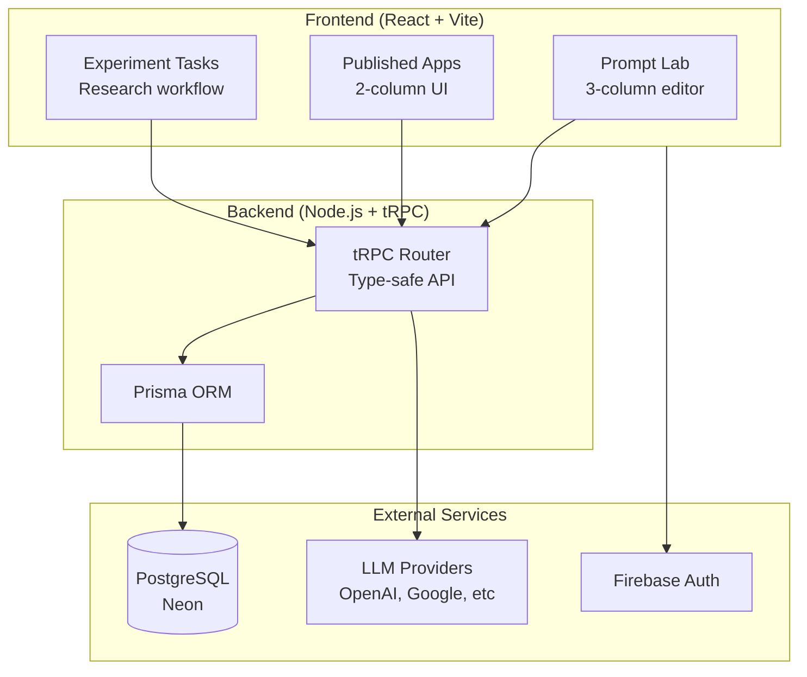

# Params.AI

**A research platform comparing chat vs form interfaces for prompt reuse in LLM applications**

## What is This?

Params.AI tests whether structured forms are better than chat for reusing AI prompts. Think of it as: "What if instead of copy-pasting prompts into ChatGPT, you could turn them into reusable apps with simple input forms?"

### The Research Question

When you create a useful AI prompt, how do you reuse it later? We're comparing two approaches:

- **Chat Interface (Baseline)** - Copy-paste and modify prompts manually, like ChatGPT
- **Form Interface (Experimental)** - Convert prompts to `{{variable}}` templates that auto-generate forms

**Example:**
```
Original: "Write a professional email to my boss about the Q4 report"

Template: "Write a {{tone}} email to {{recipient}} about {{subject}}"
         → Auto-generates form with 3 input fields
```

## Quick Start (20 minutes)

### Prerequisites
- Node.js 18+
- pnpm 8.15.4+ (`npm install -g pnpm`)
- Firebase account (free tier)
- OpenAI API key or similar LLM provider

### Installation

```bash
# 1. Clone and install
git clone <repository-url>
cd params-ai
pnpm install

# 2. Set up environment files (see SETUP.md for details)
cp packages/backend/.env.example packages/backend/.env
cp packages/frontend/.env.example packages/frontend/.env.development
# Edit .env files with your credentials (Firebase, database, LLM API keys)
# Copy Firebase service account JSON to packages/backend/src/config/firebase-key.json

# 3. Configure database (PostgreSQL or Neon)
cd packages/backend
pnpm prisma migrate dev
pnpm prisma db seed

# 4. Start development servers
cd ../..
pnpm dev
```

**First time setup?** See [SETUP.md](./docs/SETUP.md) for detailed step-by-step instructions.

### Access Points

- Frontend: http://localhost:5173
- Backend API: http://localhost:8080 (serves both REST at `/api/v1` and tRPC at `/trpc`)
- Database Studio: http://localhost:5555 (run `pnpm prisma studio` in backend)

## Project Status

### ✅ What Works
- **Form-based interface** - Fully functional prompt lab with variable extraction
- **Multi-LLM support** - OpenAI, Google Gemini, Cloudflare Workers AI
- **Experiment framework** - Database schema and admin UI for setting up studies
- **Template system** - Generalize prompts into reusable templates

### ❌ What's Missing (Priority for Contributors)
- **Chat interface** - Baseline condition for comparison study
- **Reuse workflows** - Both chat-based (Reuse 1) and form-based (Reuse 2) flows
- **Metrics tracking** - Timing, clicks, task completion rates
- **Data export** - CSV/JSON for analysis


## How It Works

### For Researchers
1. Create experiments comparing chat vs form interfaces
2. Recruit participants and track their workflows
3. Export data for statistical analysis

### For Creators (App Building)
1. Write prompts with `{{variables}}` in the Prompt Lab
2. Platform auto-generates interactive forms
3. Test and iterate in real-time
4. Publish apps for others to use

### For End Users
1. Browse published apps
2. Fill simple forms (no prompt engineering needed)
3. Get instant AI-generated results

## Architecture



**Detailed architecture?** A dedicated architecture doc is planned; meanwhile the new [User Guide](./docs/user.md) covers current UI flows and data touchpoints.

## Tech Stack

**Frontend:** React 18, TypeScript, Vite, TailwindCSS, CodeMirror, Mustache.js  
**Backend:** Node.js, Express, tRPC, Prisma  
**Database:** PostgreSQL (Neon serverless recommended)  
**Auth:** Firebase Authentication  
**LLM:** OpenAI, Google Gemini, Cloudflare Workers AI  
**Monorepo:** pnpm workspaces + Turborepo

## Project Structure

```
params-ai/
├── packages/
│   ├── frontend/        # React app with Prompt Lab and experiments
│   ├── backend/         # tRPC API + Prisma database
│   └── llm/             # LLM provider abstraction layer
├── docs/                # Documentation
│   ├── SETUP.md         # Step-by-step setup guide
│   └── user.md          # User flows mapped to the current implementation
└── README.md            # This file
```

## Common Commands

```bash
# Start both frontend and backend
pnpm dev

# Run only frontend or backend
pnpm dev:frontend
pnpm dev:backend

# Database operations
cd packages/backend
pnpm prisma studio          # Visual database browser
pnpm prisma migrate dev     # Create/apply migrations
pnpm prisma db seed         # Add sample data

# Build for production
pnpm build
```

## Documentation

- **[Setup Guide](./docs/SETUP.md)** - Detailed installation instructions with troubleshooting
- **[User Guide](./docs/user.md)** - Researcher/participant/creator/end-user flows mapped to the current code

Architecture, Research, Contributing, and API docs are planned; add an issue if you need them sooner.


**More help:** See [SETUP.md](./docs/SETUP.md#troubleshooting) for comprehensive troubleshooting.

## Research Context

This platform supports comparative studies of prompt reuse interfaces. The core hypothesis: structured form-based interfaces may improve prompt reusability compared to conversational chat interfaces.

**Key metrics being studied:**
- Time to create and generalize prompts
- Success rates of prompt reuse
- User preference and cognitive load
- Task completion rates

**Research methodology:** Document coming soon—capture interim notes in `docs/user.md` or issues.

---

**Status:** Active research project | **Contributors welcome** | **For academic and non-commercial use**
