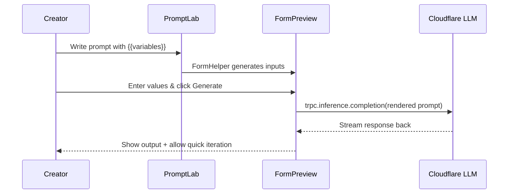
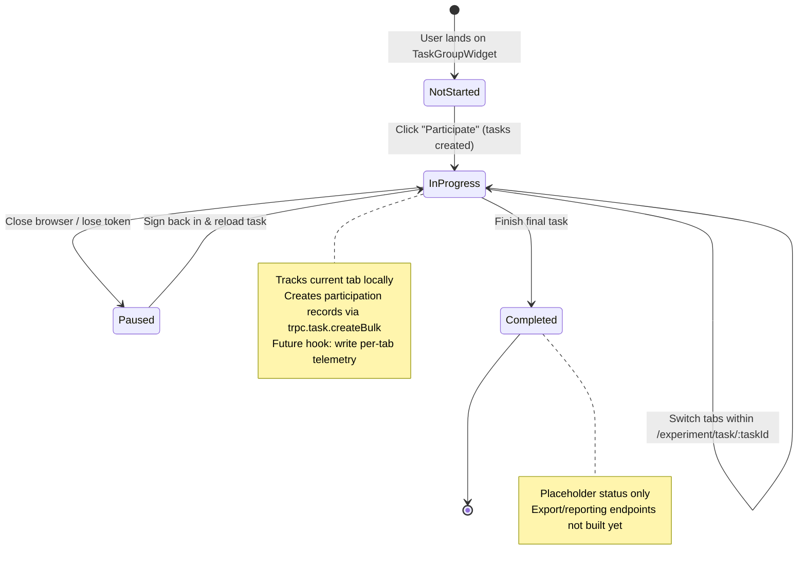
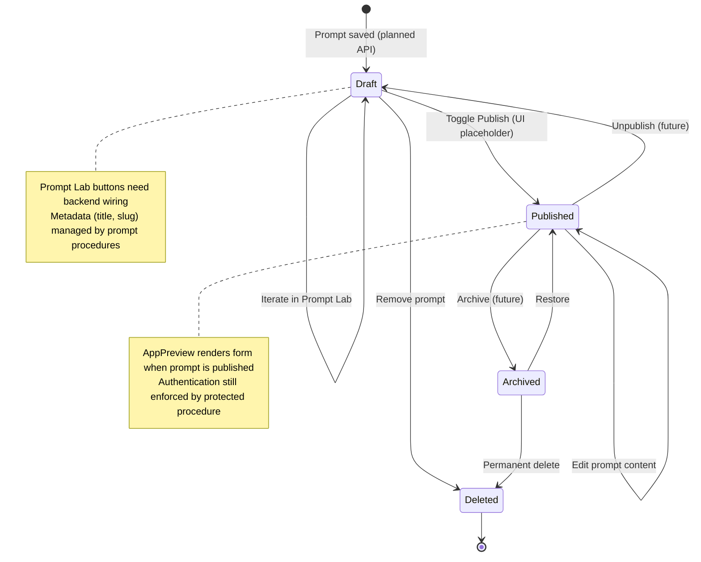

# Params.AI User Guide

This guide documents how each actor interacts with the current Params.AI codebase. It reflects the behaviour implemented in `packages/frontend` and `packages/backend` as of today so you can trace UI flows back to the source.

## Table of Contents

1. [Researcher Flow](#researcher-flow) – Set up and manage experiments
2. [Participant Flow](#participant-flow) – Work through assigned tasks
3. [Creator Flow](#creator-flow) – Build and publish reusable prompts
4. [End User Flow](#end-user-flow) – Run published prompt apps
5. [Chat vs Form Reuse](#chat-vs-form-reuse) – Side-by-side comparison
6. [Data Flow Architecture](#data-flow-architecture) – Frontend → backend → LLM
7. [State Management](#state-management) – Experiment & publishing states
8. [Next Steps](#next-steps)

---

## Researcher Flow

Researchers authenticate with Firebase (Google Sign-In via `useFirebaseAuth`) to create and curate experiments that will later be assigned to participants.

```mermaid
graph TD
    Start([Researcher opens Params.AI]) --> Login[Sign in with Google at /login]
    Login --> Dashboard[Experiment Dashboard (/experiment/dashboard)]
    Dashboard --> Settings[Open Settings tab (/experiment/dashboard/settings)]
    Settings --> ExperimentsTab[Switch to "Experiments" tab]
    ExperimentsTab --> FillBasics[Enter name and description]
    FillBasics --> SelectInterfaces[Select interface types (PickInterface)]
    SelectInterfaces --> SelectCategories[Choose prompt categories (PickCategory)]
    SelectCategories --> MapPrompts[Assign prompts per category (PickPrompt)]
    MapPrompts --> CreateExperiment[Submit form → trpc.experiment.create]
    CreateExperiment --> RefreshList[Experiment list invalidated/reloaded]
    RefreshList --> ShareInvite[Copy /experiment/:id link for participants]
    style Start fill:#e1f5ff
    style CreateExperiment fill:#c8e6c9
    style ShareInvite fill:#fff9c4
```

### Key Pages & Calls

- `/experiment/dashboard` – `ExperimentWidget` lists experiments via `trpc.experiment.list`.
- `/experiment/dashboard/settings` – Tabbed admin surface for interfaces, categories, prompts, and experiments.
- `trpc.experiment.create` (backend `experiment.procedure.ts`) stores interfaces and `categoryPromptMap` selections.

### Current Limitations

- The **“New Experiment”** button on the dashboard is present but lacks a click handler; use the Settings page to add experiments.
- Prompt/Interface catalogues must be populated first (`AddPrompt`, `AddInterface`, `AddCategory`) or the experiment form will render empty selectors.

---

## Participant Flow

Participants also authenticate with Firebase before the protected experiment routes become available. They enrol in an experiment, receive task rows per interface, and step through a five-tab task runner.

```mermaid
graph TD
    Start([Participant opens /experiment/:experimentId]) --> AuthCheck{Authenticated?}
    AuthCheck -->|No| Redirect[/login → Google Sign-In]
    Redirect --> TokenReady[Token stored in Redux/Firebase]
    TokenReady --> LoadExperiment
    AuthCheck -->|Yes| LoadExperiment[Fetch experiment via trpc.experiment.getById]
    LoadExperiment --> ParticipateClick[Click "Participate" → trpc.task.createBulk]
    ParticipateClick --> TaskBoard[TaskGroupWidget renders tasks/interfaces]
    TaskBoard --> StartTask[Click "start" → /experiment/task/:taskId]
    StartTask --> TaskTabs[Open 5-tab runner (Discover → Reuse 2)]
    TaskTabs --> CompleteTask[Finish tab & continue]
    CompleteTask --> More?{More tasks?}
    More? -->|Yes| TaskBoard
    More? -->|No| WrapUp[End of experiment]
    style Start fill:#e1f5ff
    style ParticipateClick fill:#c8e6c9
    style WrapUp fill:#81c784
```

### Task Runner Tabs (`ParticipantTask.tsx`)

- **Discover** – Static prompt instructions (`prompts[0].content`) with a stub chat textarea (chat backend pending).
- **Generalize** – Submits the current prompt through `trpc.inference.completion` to get a templated version (`PromptTemplateView`).
- **Preview** – Generates output using the templated prompt and participant-provided variables.
- **Reuse 1 / Reuse 2** – Currently reuse the `PreviewPrompt` component; dedicated chat/form reuse components live in `features/ExperimentParticipant/components/ReusePrompt` but are not mounted yet.

### Current Limitations

- The “start” link in `TaskGroupSection` points to `/experiment/task/1`; dynamic task IDs are still TODO.
- Timing, iteration counts, and completion metrics are not yet captured—backend instrumentation hooks are scaffolds only.

---

## Creator Flow

Creators build reusable prompt apps inside the Prompt Lab. All studio routes are protected so users must sign in first.

```mermaid
graph TD
    Start([Creator signs in]) --> StudioHome[Open /app/studio (Playground)]
    StudioHome --> FeaturedList[Load prompts via trpc.prompt.list]
    FeaturedList --> ViewPrompt[Click "View" card button]
    ViewPrompt --> PromptLab[/app/studio/:slug → PromptLabPage]
    StudioHome --> NewPrompt[Manually visit /app/studio/new for default template]
    PromptLab --> EditPrompt[Edit code in CodeMirror]
    EditPrompt --> ExtractVars[FormHelper.syncFormParameter extracts {{variables}}]
    ExtractVars --> LiveForm[Preview form updates]
    LiveForm --> Generate[Click "Generate" → trpc.inference.completion]
    Generate --> OutputPane[PromptOutputSection renders Cloudflare LLM result]
    style Start fill:#e1f5ff
    style Generate fill:#ffe0b2
    style OutputPane fill:#c8e6c9
```

### Prompt Lab Features

- **CodeMirror editor** with placeholder support, line wrapping, and Mustache syntax (`EditorHelper.createPlaceholder`).
- **Auto form generation** via `FormHelper.initFormWithPrompt` and `FormHelper.syncFormParameter`.
- **Live inference** backed by `trpc.inference.completion` → `LLMKit` (Cloudflare `@cf/mistral/mistral-7b-instruct-v0.1`).
- **Preview output** streamed into `PromptOutputSection`.

### Current Limitations

- The “View” button in the Playground navigates to `/studio/:slug`; update URL manually to `/app/studio/:slug` until the handler is patched.
- “Save Draft”, “Publish”, and “Share” buttons are UI-only—no persistence or status toggling is wired yet.
- Publishing metadata (`title`, `description`, `category`, icon) is not exposed in the current Prompt Lab view.

---

## End User Flow

End users access published prompt apps at `/app/:slug`. Although the route is public, the underlying `trpc.prompt.getBySlug` query is a protected procedure, so a valid Firebase token is required today.

```mermaid
graph TD
    Start([User visits /app/:slug]) --> TokenCheck{Auth token present?}
    TokenCheck -->|No| PromptLogin[Prompt to sign in (no prompt data rendered)]
    PromptLogin --> TokenReady[Complete Firebase login]
    TokenReady --> LoadPromptData
    TokenCheck -->|Yes| LoadPromptData[Fetch prompt via trpc.prompt.getBySlug]
    LoadPromptData --> RenderForm[FormHelper builds sentence-cased inputs]
    RenderForm --> Submit[Click Generate]
    Submit --> MustacheRender[Mustache.render(prompt, inputs)]
    MustacheRender --> tRPC[trpc.inference.completion]
    tRPC --> LLMKit[Backend LLMKit → Cloudflare Workers AI]
    LLMKit --> Stream[Response streamed back]
    Stream --> DisplayOutput[Output textarea updates]
    DisplayOutput --> Iterate{Need revisions?}
    Iterate -->|Yes| RenderForm
    Iterate -->|No| Finish[Copy result / close]
    style Start fill:#e1f5ff
    style Submit fill:#ffe0b2
    style DisplayOutput fill:#c8e6c9
```

### Experience Details

- Two-column layout (`AppPreview`) with labelled inputs on the left and generated output on the right.
- Inputs are sentence-cased via `StringUtils.sentenceCase`.
- Responses are streamed and cached with React Query; loading state shows `"Loading..."`.

### Current Constraints

- No unauthenticated access: consider exposing a public prompt retrieval procedure before sharing links externally.
- Results are not persisted; refreshing clears the generated content history.

---

## Chat vs Form Reuse

### Chat-Based Reuse (Baseline Runner in “Discover”)

```mermaid
sequenceDiagram
    participant Participant
    participant DiscoverTab as Discover Tab
    participant ChatStub as Chat Textarea

    Participant->>DiscoverTab: Read original prompt instructions
    DiscoverTab-->>Participant: Display prompt from prompts[0].content
    Participant->>ChatStub: Type prompt manually (no paste)
    ChatStub-->>Participant: Local echo only (no backend call yet)
    note over Participant,ChatStub: Users repeat typing & editing for each variant
```

**Cognitive Load Today**

- Manual transcription introduces errors; behaviour matches the stubbed chat UI.
- No history panel or undo—participants must keep their own notes.

### Form-Based Reuse (Prompt Lab & App Preview)



**Advantages Observed**

- Variable scaffolding highlights what can change.
- Switching values keeps prompt structure intact across tasks.

---

## Data Flow Architecture

```mermaid
graph LR
    subgraph Frontend (React + Redux)
        A[Form inputs (PromptLab/AppPreview)]
        B[FormHelper & Mustache.render]
        C[trpc.inference.completion mutation]
        D[React Query cache]
    end

    subgraph Backend (Node + tRPC)
        E[Inference procedure]
        F[LLMKit wrapper]
    end

    subgraph Cloudflare Workers AI
        G[@cf/mistral/mistral-7b-instruct-v0.1]
    end

    A --> B --> C --> E --> F --> G
    G --> F --> E --> D --> UI[UI components update]

    style A fill:#e1f5ff
    style E fill:#fff9c4
    style F fill:#ffe0b2
    style D fill:#c8e6c9
```

**Key Contracts**

- `trpc.inference.completion` accepts `{ prompt: string }`.
- `LLMKit` currently targets the Cloudflare connector; swap the provider in `packages/llm` to change models.
- Responses are pushed back into React Query so both Prompt Lab and App Preview reuse the same cache.

---

## State Management

### Experiment Participation Lifecycle



### Prompt Publishing Lifecycle



---

## Next Steps

- **Setup & Environment** – Follow `docs/SETUP.md` for local installation, Firebase, and database provisioning.
- **User Flows** – Keep this `docs/user.md` up to date when wiring chat, metrics, or publishing APIs.
- **Open todos** – Wire the dashboard “New Experiment” CTA, fix Playground → Prompt Lab navigation, and expose a public prompt read endpoint before distributing `/app/:slug` links.

Questions or new edge cases? Open an issue or add notes in `docs/user.md` so the documentation stays aligned with the code.
